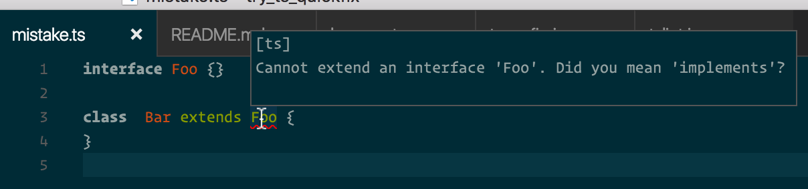
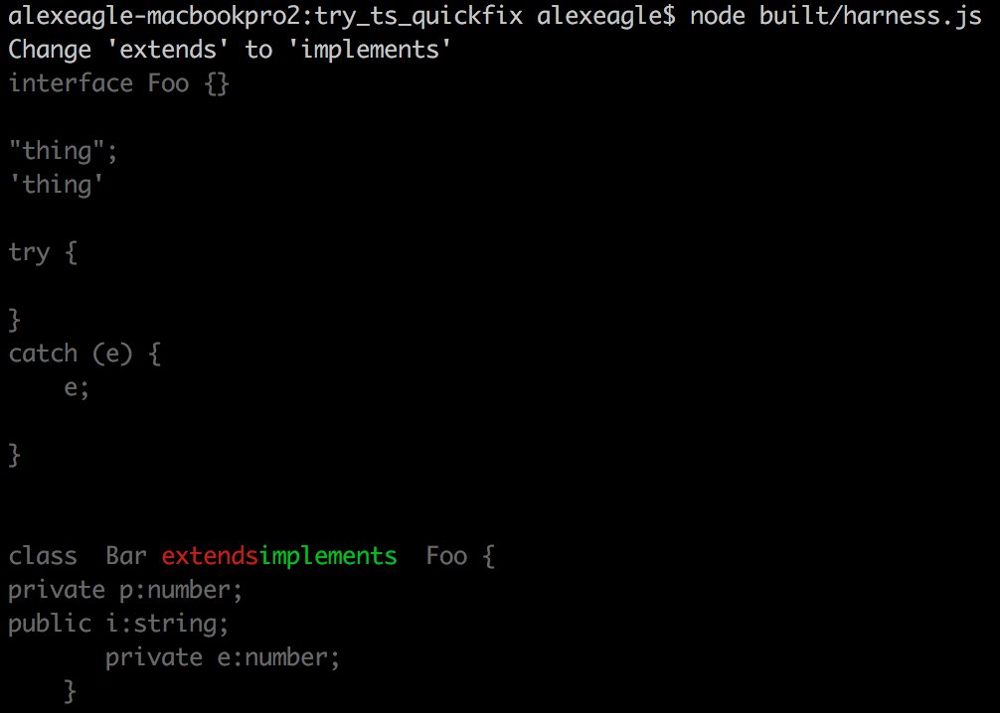
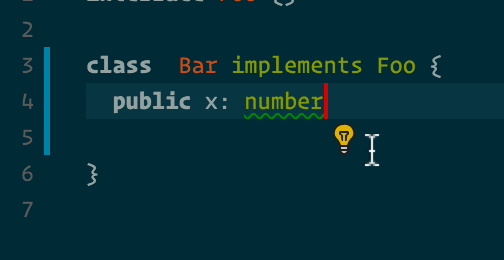
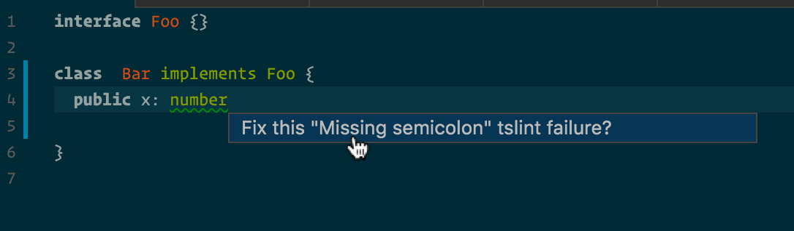

# Quick fixes in TypeScript

Quick fixes are coming in TypeScript, scheduled in 2.1 (see the [Roadmap](https://github.com/Microsoft/TypeScript/wiki/Roadmap#21))

This is great in a lot of scenarios:
- In your editor, you'll have the "just fix it please" action.
- You'll usually fix errors before checking in your code, but for warnings it's cool to 
  hook up your code review tool to suggest/apply fixes for issues it highlights.
- We use it for big-codebase janitoring. When a new error is added to the compiler
  (like `--noImplicitReturns` say) we can apply a fix automatically against all of Angular
  for example.

# Try it out

Here's a program with a simple diagnostic:

If you pull https://github.com/Microsoft/TypeScript/pull/9304 you can build a
TypeScript that knows how to fix some diagnostics. (I did it a month ago, that work
is now split into more PRs).

Since this isn't available in any editors yet, I wrote a little command-line [harness](harness.ts) to run it
and just print the diff it would apply:

The red text would be removed and the green text would be added.

Thanks https://github.com/paulvanbrenk - this will be cool :smile:

# Quick fixes in TSLint

My intern, https://github.com/ScottSWu just finished up his summer working on TSLint.

We wanted to be able to make style changes across Google's TS code. So he added
the ability for TSLint checks to propose code changes: https://github.com/palantir/tslint/pull/1423

Then he added a fix for the [type-assertion rule](https://github.com/ScottSWu/tslint/blob/master/src/rules/noAngleBracketTypeAssertionRule.ts),
where you can pick between `<string>s` or `(s as string)` - at Google our style guide prefers the latter.

We wrote a tool to automatically correct all the code with wrong style.

# VSCode has special support for TSLint

Before fixes were part of TSLint, the VSCode team put up a [contrib rule set](https://github.com/Microsoft/tslint-microsoft-contrib) which has quick fixes wired to a [TSLint VSCode extension](https://marketplace.visualstudio.com/items?itemName=eg2.tslint). Using the `.vscode/settings.json` in this repo, 
I can fire up VSCode and see a lightbulb next to a style issue:

and clicking that gives you the chance to apply the fix:

I look forward to getting the new fixes in TSLint hooked up to VSCode and other editors!
